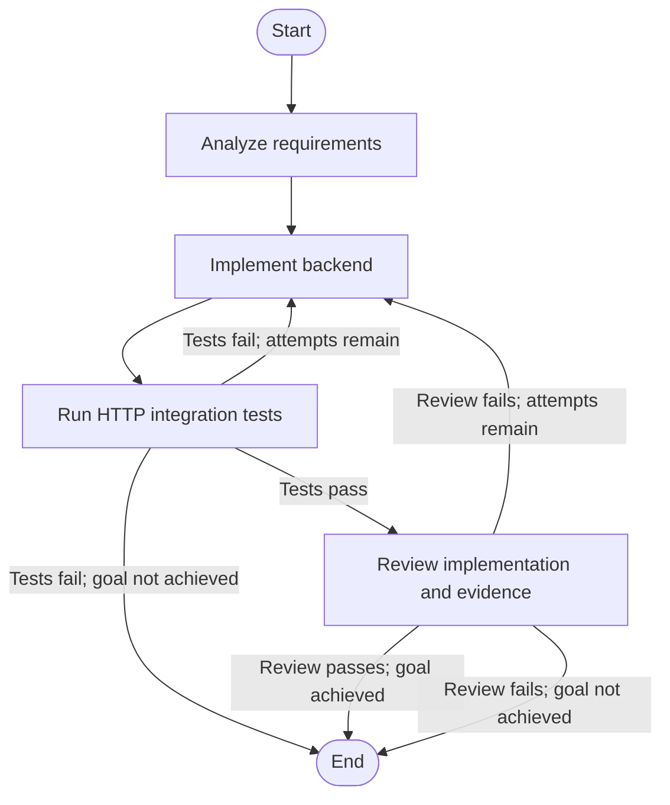

```mermaid
flowchart TD
  start([Start])
  finished([End])
  start --> n0
  n0["Analyze requirements"]
  n1["Implement backend"]
  n2["Run HTTP integration tests"]
  n3["Review implementation and evidence"]
  n0 --> n1
  n1 --> n2
  n2 -->|"Tests pass"| n3
  n2 -->|"Tests fail; attempts remain"| n1
  n2 -->|"Tests fail; goal not achieved"| finished
  n3 -->|"Review passes; goal achieved"| finished
  n3 -->|"Review fails; attempts remain"| n1
  n3 -->|"Review fails; goal not achieved"| finished
```
